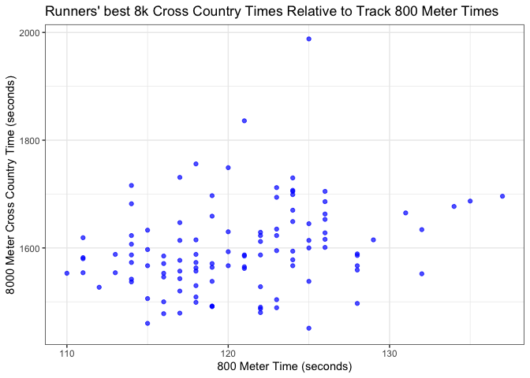
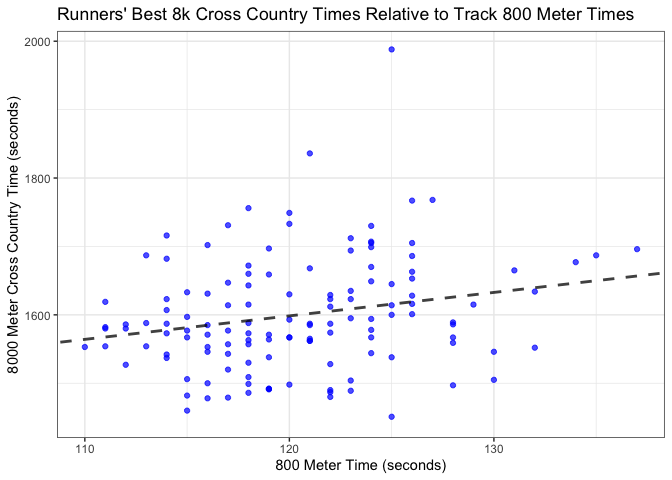
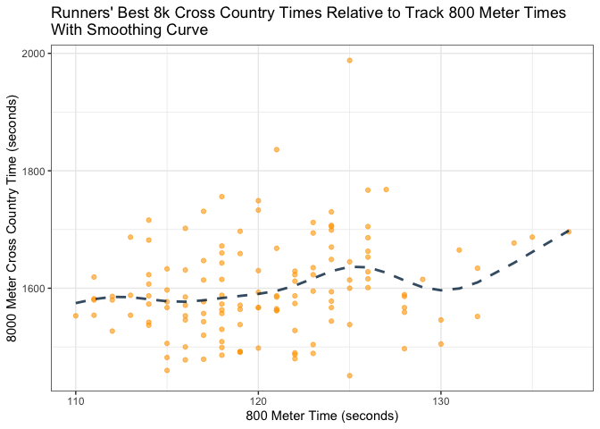
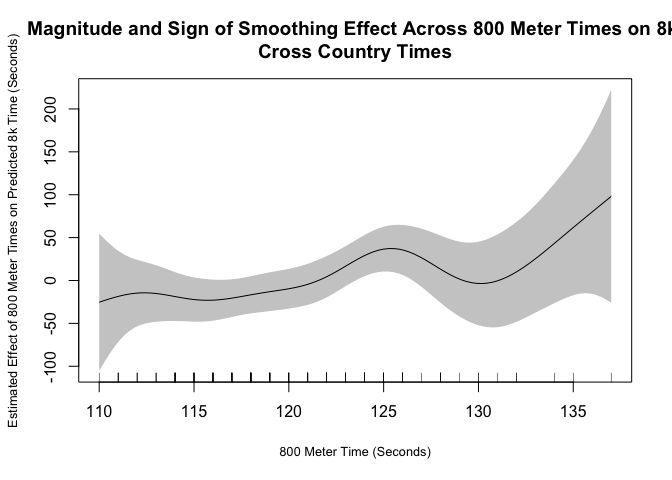
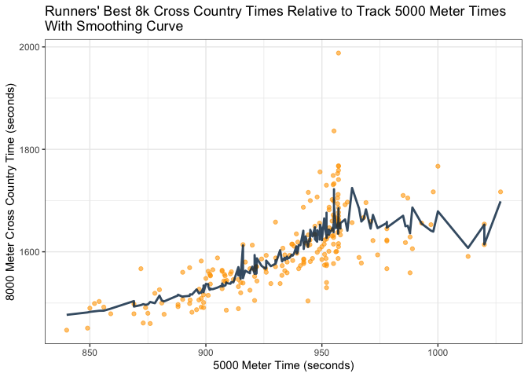
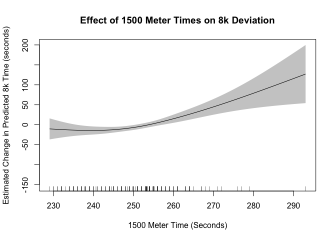
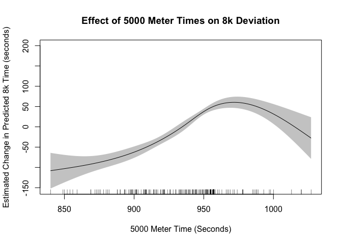

Statistical Learning Final Project
================
Drew Donahue
2025-05-19

This report will use a collection of NESCAC cross country and track
data, scraped from the website tfrrs.org, to ultimately model a NESCAC
runner’s best cross country performance using their respective best
track times. The data consists of active roster members on each NESCAC
cross country team in 2024. To fit the relationship between each
runner’s best 8000 meter cross country race to - generally less
variable - track times, a generalized additive model will be used and
explained in detail. Typically, runners argue that if you are fast on a
cross country course, you will generally be faster on the track. Though,
some think that the opposite is not always true. Through the use of a
generalized additive model, I hope to explore the argument that faster
track times simply translate to faster cross country times - or
determine if there is perhaps a more nuanced relationship or if the
relationship is purely linear.

Load packages

``` r
library(tidyverse)
library(mgcv)
library(janitor)
library(Hmisc)
library(missForest)
```

Load the already scraped data and clean into format that can be used in
the general additive model (GAM)

``` r
get_seconds <- function(df) { 
  new_df <- df |> separate(period_time, into = c("min", "sec", "hundredths"), sep = ":", convert = TRUE) %>%
    mutate(total_seconds = min * 60 + sec + hundredths / 100)  
}
 

xc_data <- read_csv("/Users/drew/Documents/Middlebury/Year 4/Spring/Stat Learning/Final Project/xc_data.csv")

xc_data_clean <- xc_data |> 
  filter_at(vars("1500", "5000", "MILE", "800"),any_vars(!is.na(.))) |> 
  mutate("8k" = case_when(
    is.na(`8k`) ~ `8K (XC)`, 
    TRUE ~ `8k`
  )) |> 
  filter(!is.na(`8k`))

xc_data_clean$`8K (XC)` <- NULL
                
time_cols <- c("1500", "5000", "MILE", "800", "8k")

xc_data_clean[time_cols] <- map_dfc(time_cols, ~ {
  xc_data_clean %>%
    separate(.data[[.x]], into = c("min", "sec", "hundredths"), sep = ":", convert = TRUE) %>%
    transmute(min * 60 + sec + hundredths / 100)
})

xc_data_clean <- xc_data_clean |> 
  clean_names()

write_csv(xc_data_clean, "/Users/drew/Documents/Middlebury/Year 4/Spring/Stat Learning/Final Project/xc_clean.csv")
```

Now that the data is prepared for use, let’s explore the data with a
GAM. A GAM works in a way not entirely different from a standard linear
regression model. GAM’s accounts for the non-linearity between some
variables and essentially models in such a way that allows for multiple
types of relationships to form. In other words, some variables may have
a more exponential relationship with a target variable than others, and
the GAM accounts for this. Below is a graph simply of the relationship
between 800 meter times in track and 8000 meter times in cross country
which does not seem to exhibit a linear relationship.

``` r
xc_data_clean |> 
  filter(!is.na(mile)) |> 
  ggplot() + 
  geom_point(aes(x = x800, y = x8k), color = "blue", alpha = 0.7) + 
  labs(title = "Runners' best 8k Cross Country Times Relative to Track 800 Meter Times", 
       x = "800 Meter Time (seconds)", 
       y = "8000 Meter Cross Country Time (seconds)") +
  theme_bw()
```

<!-- -->

Due to the variability among data points in this graph, it seems like a
simple linear regression model would not tell the whole story. We can
try comparing a simple GAM model with a linear regression model to see
how the two differ. Both the GAM and the linear regression model will
only take into account 800 meter times when attempting to model cross
country times.

``` r
lm_800 <- lm(
  x8k ~ x800, 
  data = xc_data_clean)

#Get coefficient info
coeff<-coefficients(lm_800)          
intercept<-coeff[1]
slope<- coeff[2]

xc_data_clean |> 
  ggplot() + 
  geom_point(aes(x = x800, y = x8k), color = "blue", alpha = 0.7) + 
  geom_abline(intercept = intercept, 
              slope = slope, 
              linetype = "dashed", 
              size = 1, 
              alpha = 0.75) +
  labs(title = "Runners' Best 8k Cross Country Times Relative to Track 800 Meter Times", 
       x = "800 Meter Time (seconds)", 
       y = "8000 Meter Cross Country Time (seconds)") +
  theme_bw() 
```

<!-- -->

The graph above depicts the same scatter plot of 800 meter track times
versus 8000 meter cross country times, though this time it is shown with
a line of best fit. The line was created using a linear regression model
that fitted the data under the assumption that each constant increase in
800 meter time will always have the same effect on cross country 8k
times.

``` r
first_gam <- gam(
  x8k ~ s(x800), 
  data = xc_data_clean)

gam_sum <- summary(first_gam)

data.frame(EDF = gam_sum$edf, 
           `P Value` = gam_sum$s.pv)
```

    ##       EDF    P.Value
    ## 1 5.46862 0.09316852

The above information gives a very broad overview of the result of this
simple GAM. The EDF stands for “Effective Degrees of Freedom.” When this
term is equal to 1, it indicates that the relationship between a
predictor variable and a target variable was found to be linear. Thus,
since it is equal to ~5.47 in this model, the GAM added smoothing rather
than just using a straight line to fit the data. Additionally, the
p-value is indicative of the statistical significance of the model -
just as it is for any linear regression or other statistical model. With
a p-value of 0.093, this GAM model using only 800 meter track times is
not statistically significant at the 5% level, thus it does not have
strong predicting power on its own. This makes sense given that the 800
meter race is considered a middle distance event while the 8k is
considered long distance. Strong 800 meter performers do not necessarily
have the stamina to put together fast 8k times, and some runners may not
have the leg speed to sprint to a fast 800 meter time but can be very
consistent at a slightly slower pace - making them very talented in
cross country races. Let’s visualize how the GAM fit this data!

``` r
xc_data_clean |> 
  filter(!is.na(x800)) |> 
  mutate(preds = predict(first_gam)) |> 
  ggplot() + 
  geom_point(aes(x = x800, y = x8k), color = "orange", alpha = 0.6) + 
  geom_line(aes(x = x800, y = preds), 
            color = "#002748", 
            linetype = "dashed", 
            size = 1, 
            alpha = 0.8) + 
  labs(title = "Runners' Best 8k Cross Country Times Relative to Track 800 Meter Times
With Smoothing Curve", 
       x = "800 Meter Time (seconds)", 
       y = "8000 Meter Cross Country Time (seconds)") +
  theme_bw()
```

<!-- -->

The orange points above again represent the same data points of all
NESCAC men’s cross country runners in 2024 who have run an 800 in their
college careers. The dashed line this time, however, is the smoothed
line of best fit created by the GAM model. As seen above, the line is
relatively flat for the fastest NESCAC 800 meter runners (in the 1:50 -
2:00 800 meter range). In other words, a 1:50 800 meter runner in the
NESCAC is expected to run about the same time in cross country as a 2:00
800 meter runner - despite a very large 10 second difference in their
strongest 800 meter race. Runners running in the 2:00 - 2:05 range seem
to on average be relatively slower in the 8k relative to 1:55 - 2:00 and
2:05 - 2:10 runners. Finally, a linear trend seems to steadily emerge on
the right end of the chart with those running slower than 2:10. The GAM
model ultimately shows slightly more complexity in the data, in that a
second difference in 800 times among the fastest NESCAC runners is not
as significant when predicting 8k times as a second difference in 800
times between the slowest NESCAC runners.

``` r
plot(first_gam, shade = TRUE, 
     main = "Magnitude and Sign of Smoothing Effect Across 800 Meter Times on 8k 
Cross Country Times", 
     xlab = "800 Meter Time (Seconds)", 
     ylab = "Estimated Effect of 800 Meter Times on Predicted 8k Time (Seconds)", 
cex.lab = 0.8) 
```

<!-- -->

Similar to the smoothing curve figure shown prior, this graph depicts
the smoothing effect modeled in the GAM by plotting 800 times with
estimated deviation from the y intercept. From this, we can get a deeper
look into how the GAM made the curve seen before. The model accounts for
certain 800 meter times having a stronger negative or positive influence
on the predicted 8k value. The shaded area surrounding the curve
represents how ‘confident’ the model is in its prediction at any given
800 meter time. The tighter the area is to the curve, the more confident
the model is. Hence, because there are not many runner with 800 meter
times exceeding 2:10, and their respective 8k times are slightly
variable, the area around the curve in this section of the graph is
quite large.

Let’s now try to make some more accurate predictions with the use of
other distance track times. Since there are many missing values in the
data, as not all distance runners always run every distance event in
track, a random forest will be used to estimate and replace these
missing values through the missForest package.

``` r
set.seed(3)

miss_forest_output <- missForest(xc_data_clean |> 
                             select(-c("name_id", "x1")) |> 
                             as.data.frame(), 
                           ntree = 50, 
                           maxnodes = 3)

full_xc_data <- miss_forest_output$ximp
```

``` r
better_gam <- gam(x8k ~ s(x1500, k = 5, bs = "cr") + s(x5000, k = 5, bs = "cr"), 
                  data = full_xc_data, 
                  select = TRUE)

full_xc_data |> 
  mutate(preds = predict(better_gam)) |> 
  ggplot() + 
  geom_point(aes(x = x5000, y = x8k), color = "orange", alpha = 0.6) + 
  geom_line(aes(x = x5000, y = preds), 
            color = "#002748", 
            size = 1, 
            alpha = 0.8) + 
  labs(title = "Runners' Best 8k Cross Country Times Relative to Track 5000 Meter Times
With Smoothing Curve", 
       x = "5000 Meter Time (seconds)", 
       y = "8000 Meter Cross Country Time (seconds)") +
  theme_bw()
```

<!-- -->

When talking about a generalized additive model, one of its strengths is
its additive abilities. This means that in the context of this report,
the nonlinear relationships of multiple track events being used as
predictors can be added together in a linear fashion to make a perhaps
more accurate prediction given the data. I believed that 1500 meter and
5000 meter races together would most accurately allow a GAM model to
make accurate predictions. The above graph shows the resulting GAM fit
along with the imputed data from the random forest. Since this graph is
shown on just the 5000 meter axis, and the model uses two predictors,
the curve is sharper and more spiky than the 800 meter curve shown
earlier. Though, this graph ultimately shows a fairly linear
relationship between 5000 meter track times and 8k cross country times
up until roughly the 16:00 mark in the 5k.

Now we can plot the individual affects of both variables on predicted 8k
times:

``` r
plot(better_gam, select = 1, shade = TRUE, 
     main = "Effect of 1500 Meter Times on 8k Deviation", 
     xlab = "1500 Meter Time (Seconds)", 
     ylab = "Estimated Change in Predicted 8k Time (seconds)")
```

<!-- -->

1500 meter times have in this model again a fairly linear relationship
with 8k times in the NESCAC. Runners in roughly the 3:50 to 4:10 range,
however, have a very similar effect on predicted 8k times. Additional
seconds to 1500 times after the 4:10 mark seem to be linear with 8k
times. This linear relationship reflects the initial argument introduced
that faster track times result in faster cross country times.

``` r
plot(better_gam, select = 2, shade = TRUE, 
     main = "Effect of 5000 Meter Times on 8k Deviation", 
     xlab = "5000 Meter Time (Seconds)", 
     ylab = "Estimated Change in Predicted 8k Time (seconds)")
```

<!-- -->

In the plot above, 5000 meter times have a very interesting effect on
the change in predicted 8k times. Between the 14:00 and 16:00 5k marks
in the NESCAC, the relationship between 5k times and the estimated
change in predicted 5k times resembles that of a positive exponential
relationship. Thus, as a runner approaches the 14:00 mark in the 5k,
each second taken off is estimated to take less time off of their
respective 8k. There is also an interesting dip in predicted cross
country times for runners slower than about 16:30 in the 5k, but this is
likely due to a relative lack of data points in this range.

Ultimately, it was found through this report that shaving seconds off of
distance track events does not necessarily result in a linear decrease
in cross country times. As runners get faster in NESCAC distance track
events, they are relatively less likely to set themselves apart from the
competition around them; there is generally more diversity in track
times on the faster end of cross country runners than there is on the
slower end. In the end, some runners are particularly talented in cross
country, and this is not necessarily reflected in their distance track
times - especially on the top end.
